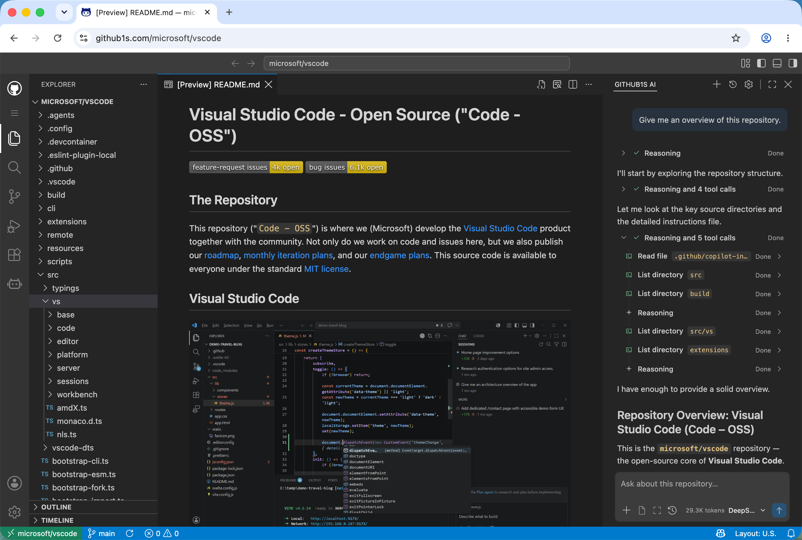

# GitHub1s

GitHub1s is a browser-based code explorer built on VS Code. Browse files, search code, and review changes without cloning a repository. Connect your preferred model to the built-in AI chat for help understanding the code.

**[🌐 Try it now](https://github1s.com/conwnet/github1s)** · [📖 Usage guide](docs/usage.md) · [🔮 AI setup](docs/ai.md#configure-a-model)

## 🚀 Quick start

Add **`1s` after `github`** in a repository URL:

```text
https://github.com/microsoft/vscode
        ↓
https://github1s.com/microsoft/vscode
```

Public repositories can be browsed **without signing in**, subject to the upstream services' access and rate limits.



You can also browse GitLab repositories at [gitlab1s.com](https://gitlab1s.com) and published npm packages at [npmjs1s.com](https://npmjs1s.com). See the [usage guide](docs/usage.md) for URL formats, authentication, and navigation.

## ✨ Features

- **Explore a project.** Browse directories, find files, and search code in a familiar VS Code interface.
- **Trace a change.** Switch branches or tags, inspect commits and file history, and review pull or merge request diffs on GitHub and GitLab.
- **Understand complex code.** Ask GitHub1s AI about a file or selection, then follow up on implementation details.
- **Access private repositories.** Connect your GitHub or GitLab account, or supply an access token with the necessary permissions.

Remote repositories are **read-only**. Search and code navigation depend on the repository platform and available upstream services; see [capabilities and limits](docs/usage.md#capabilities-and-limits).

## 🤖 GitHub1s AI

Get a repository overview, explain a file or selection, and ask follow-up questions. The assistant can look up relevant code as you chat.

Click **Toggle Secondary Side Bar** in the layout controls at the top of GitHub1s to open the AI panel.

Use a **model endpoint that accepts browser requests**. Messages and code context are sent to the selected endpoint. See the [AI guide](docs/ai.md) for configuration and data handling.

## 📚 Documentation

| Guide                                | What you will find                                      |
| ------------------------------------ | ------------------------------------------------------- |
| [Using GitHub1s](docs/usage.md)      | Navigation, authentication, search, and troubleshooting |
| [GitHub1s AI](docs/ai.md)            | Model setup, context, tools, and data handling          |
| [Development](docs/development.md)   | Local setup, builds, and checks                         |
| [Architecture](docs/architecture.md) | Components, data flow, and source layout                |
| [Deployment](docs/deployment.md)     | Hosting, OAuth, and service configuration               |
| [Community](docs/community.md)       | Third-party extensions and star history                 |

## 🤝 Contributing

See the [development guide](docs/development.md) to run GitHub1s locally. Report bugs and suggest improvements through [GitHub Issues](https://github.com/conwnet/github1s/issues).

## 👥 Maintainers

[conwnet](https://github.com/conwnet) · [xcv58](https://github.com/xcv58) · [Siddhant Khare](https://github.com/Siddhant-K-code)

## 💖 Thanks

Thanks to everyone who has contributed to GitHub1s, and to [Sourcegraph](https://sourcegraph.com/), [searchcode](https://searchcode.com/), and [OSS Insight](https://ossinsight.io/) for the tools and services used by GitHub1s.

## 📄 License

[MIT](LICENSE)
