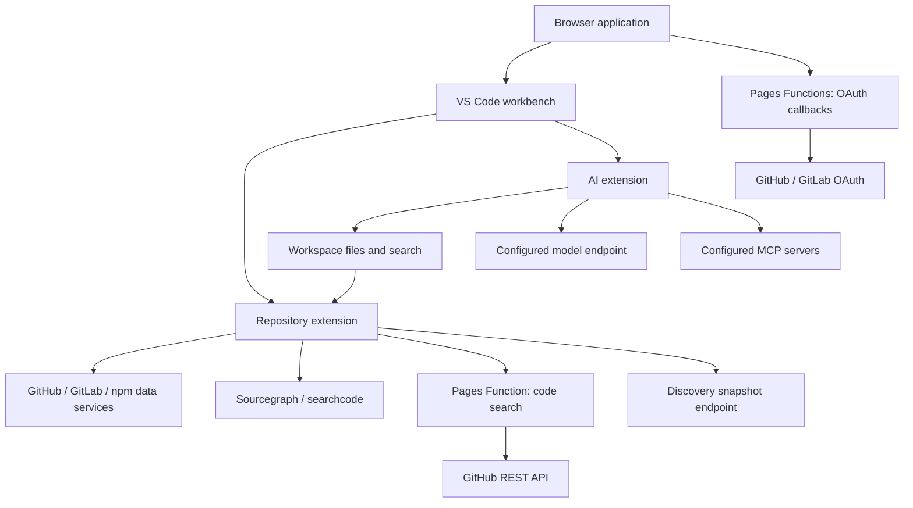

# Architecture

[Documentation](guide.md) · [Development](development.md) · [Deployment](deployment.md)

GitHub1s combines a browser build of VS Code with extensions that expose remote repositories as read-only workspaces. The browser loads files on demand through platform APIs and external code services. Pages Functions handle OAuth callbacks and a GitHub code-search proxy; a separate Worker supplies repository discovery snapshots.

## Components

| Component            | Responsibility                                                                     | Source                                                  |
| -------------------- | ---------------------------------------------------------------------------------- | ------------------------------------------------------- |
| Web application      | Select the platform and workspace, load VS Code, and bridge browser authentication | [`src/`](../src/)                                       |
| VS Code web package  | Build and package VS Code with GitHub1s-specific source overlays                   | [`vscode-web/`](../vscode-web/)                         |
| Repository extension | Route repository URLs, provide files and search, and display history and diffs     | [`extensions/github1s/`](../extensions/github1s/)       |
| AI extension         | Manage chat, model connections, repository context, and optional MCP tools         | [`extensions/github1s-ai/`](../extensions/github1s-ai/) |
| Pages Functions      | Exchange OAuth authorization codes and proxy GitHub REST code search               | [`functions/`](../functions/)                           |
| Discovery Worker     | Collect public repositories and publish scheduled snapshots                        | [`workers/discovery/`](../workers/discovery/)           |

The root `src/` directory is the application entry point. VS Code source overlays live under `vscode-web/src/`.

## Opening a repository

1. [`src/index.ts`](../src/index.ts) selects a platform from the hostname and extracts the repository or package from the path.
2. [`src/config.ts`](../src/config.ts) creates the workspace configuration. GitHub, GitLab, and npm use different URI schemes; the GitHub home page opens Discovery.
3. The [repository extension](../extensions/github1s/src/extension.ts) registers adapters and VS Code providers.
4. A platform adapter parses the URL and supplies a data source. VS Code requests files, directory listings, or search results through the corresponding provider.
5. The extension fetches data and presents it in the editor, Explorer, or source control views.

The file system providers are registered as read-only. The separate `/editor` entry opens an editor workspace without mounting a remote repository.

## Repository adapters and search

Adapters separate platform behavior from VS Code providers. Each adapter supplies URL parsing, data access, and the views supported by that platform. Start with the [adapter types](../extensions/github1s/src/adapters/types.ts) and [adapter registration](../extensions/github1s/src/adapters/index.ts) when changing a platform integration.

GitHub data access uses REST and GraphQL. When **Prefer to use Sourcegraph API** is enabled, supported operations try Sourcegraph first. GitHub text search then falls back to searchcode, followed by GitHub REST code search through the same-origin `/api/github/search/code` proxy. Definition, reference, and hover results use Sourcegraph separately.

These services have different indexing, authentication, and query capabilities. The [usage guide](usage.md#search-and-code-navigation) describes the user-visible limitations. The current GitHub fallback sequence is implemented in [`data-source.ts`](../extensions/github1s/src/adapters/github1s/data-source.ts).

## Authentication and data flow

Repository tokens are persisted through VS Code extension global state in the browser. Direct authenticated repository API requests include the relevant token. The GitHub search fallback also sends the authorization header to the same-origin Pages Function, which forwards it to GitHub.

OAuth uses a popup and a server-side callback. The callback exchanges the authorization code for a token, then returns the result to the browser. OAuth application secrets belong to the callback runtime. See [deployment configuration](deployment.md#configure-oauth) and [user authentication](usage.md#authentication-and-private-repositories).

The AI extension has a separate model configuration and conversation store. It sends conversation context and tool results to the selected model endpoint and can connect to user-configured MCP servers. See [AI data handling](ai.md#data-and-storage) for the boundaries users need to understand.

## Repository discovery

The Discovery Worker runs GitHub Search queries on a schedule, combines their results into a snapshot, and stores it in Workers KV. The browser's Discovery adapter reads the public snapshot endpoint and renders repository collections as a virtual workspace.

This service is separate from repository file access. Its configuration, collection rules, and refresh behavior are documented in the [Discovery Worker README](../workers/discovery/README.md).

## Builds and source overlays

The normal application build uses the published `@github1s/vscode-web` package, compiles the local extensions, and bundles the web entry with webpack. Output goes to `dist/`, with assets grouped under a directory derived from the Git commit.

The `vscode-web/` build clones the revision recorded in [`.VERSION`](../vscode-web/.VERSION), applies source overlays, and packages the result. Keeping that build separate lets most changes use the prebuilt editor. Changes to VS Code itself use the [full VS Code development workflow](development.md#develop-with-a-local-vs-code-build).
